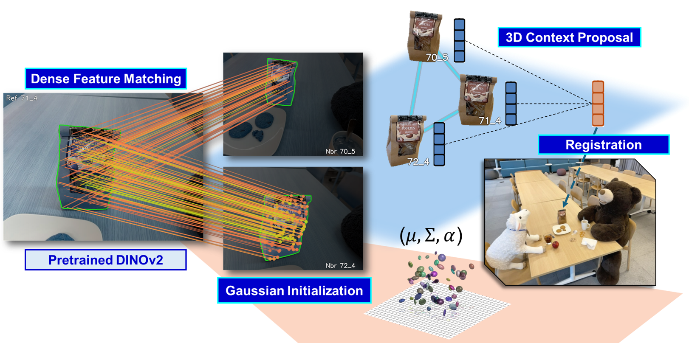
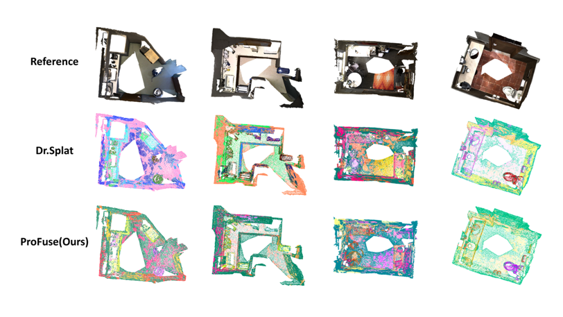

# ProFuse: Efficient Cross-View Context Fusion for Open-Vocabulary 3D Gaussian Splatting

We present ProFuse, an efficient context-aware framework for open-vocabulary 3D scene understanding with 3D Gaussian Splatting (3DGS). The pipeline enhances cross-view consistency and intra-mask cohesion within a direct registration setup, adding minimal overhead and requiring no render-supervised fine-tuning. Instead of relying on a pretrained 3DGS scene, we introduce a dense correspondence–guided pre-registration phase that initializes Gaussians with accurate geometry while jointly constructing 3D Context Proposals via cross-view clustering. Each proposal carries a global feature obtained through weighted aggregation of member embeddings, and this feature is fused onto Gaussians during direct registration to maintain per-primitive language coherence across views. With associations established in advance, semantic fusion requires no additional optimization beyond standard reconstruction, and the model retains geometric refinement without densification. ProFuse achieves strong open-vocabulary 3DGS understanding while completing semantic attachment in about five minutes per scene, which is 2× faster than SOTA.

## 0. Installation

## 1. Data preparation

## 2. Pre-regostration

## 3. Feature registration

## 4. 3D object selection

## 5. 3D point cloud understanding

## 6. ToDo list

- [ ] Data preprocessing
- [ ] Pre-registration
- [ ] Feature registration
- [ ] Evaluation
- [ ] Pretrained checkpoint
