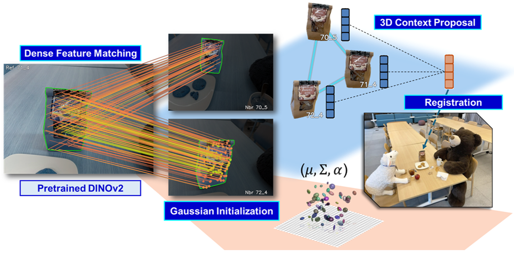
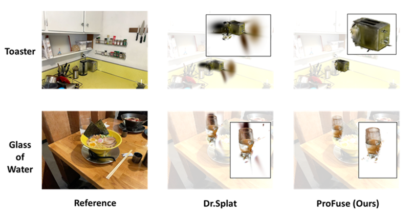

# ProFuse: Efficient Cross-View Context Fusion for Open-Vocabulary 3D Gaussian Splatting


We present ProFuse, an efficient context-aware framework for open-vocabulary 3D scene understanding with 3D Gaussian Splatting (3DGS). The pipeline enhances cross-view consistency and intra-mask cohesion within a direct registration setup, adding minimal overhead and requiring no render-supervised fine-tuning. Instead of relying on a pretrained 3DGS scene, we introduce a dense correspondence–guided pre-registration phase that initializes Gaussians with accurate geometry while jointly constructing 3D Context Proposals via cross-view clustering. Each proposal carries a global feature obtained through weighted aggregation of member embeddings, and this feature is fused onto Gaussians during direct registration to maintain per-primitive language coherence across views. With associations established in advance, semantic fusion requires no additional optimization beyond standard reconstruction, and the model retains geometric refinement without densification. ProFuse achieves strong open-vocabulary 3DGS understanding while completing semantic attachment in about five minutes per scene, which is 2× faster than SOTA.

## 0. Installation
Clone the repo

```bash
git clone https://github.com/chiou1203/ProFuse.git
cd ProFuse
```

Setup

```bash
pip install torch torchvision torchaudio --index-url https://download.pytorch.org/whl/cu121
pip install fused-local-corr==0.1.1 pycolmap hydra-core tqdm torchmetrics lpips matplotlib rich plyfile \
            imageio imageio-ffmpeg plotly scikit-learn moviepy==2.1.1 ffmpeg numpy==1.26.4 open_clip_torch
pip install -q --no-deps loguru
pip uninstall -y blosc2 dataproc-spark-connect bigframes libpysal plotnine \
                  geopandas thinc treescope tensorflow tsfresh || true
pip install -r requirements.txt
```

Install submodules for pre-registration

```bash
cd preregistration
pip install -q submodules/gaussian-splatting/submodules/diff-gaussian-rasterization
pip install -q --no-deps submodules/RoMa
```

Install submodules for registration

```bash
cd registration
pip install -q submodules/langsplat-rasterization \
                submodules/segment-anything-langsplat \
                submodules/simple-knn \
                ninja kmeans_pytorch faiss-cpu
```

## 1. Data preparation
For pre-registration, prepare the scene folder like the following:

```text
data_root/
├─ images/
├─ sparse/
└─ language_features/
```

For registration, move the 3DGS scene folder to data root :

```text
data_root/
├─ images/
├─ sparse/
└─ language_features/
└─ GS/
└─ input.ply
```

## 2. Pre-registration
You can run the following script for pre-registration.
```bash
chmod +x scripts/pre_registration.sh 
./scripts/pre_registration.sh
```

## 3. Feature registration
You can run the following script to do feature registration.
```bash
chmod +x scripts/pre_registration.sh 
./scripts/registration.sh
```

## 4. 3D object selection

(TBA)
## 5. 3D point cloud understanding

(TBA)
## 6. ToDo list

- [ ] Data preprocessing
- [ ] Evaluation
- [ ] Pretrained checkpoint

## 6. Citation
If you find our work useful, please consider cite it in your work.
```text
@inproceedings{profuse-2026,  title = {ProFuse: Efficient Cross-View Context Fusion for Open-Vocabulary 3D Gaussian Splatting},  author = {Anonymous},  booktitle = {Proceedings of the IEEE/CVF Conference on Computer Vision and Pattern Recognition},  year = {2026}}
```
